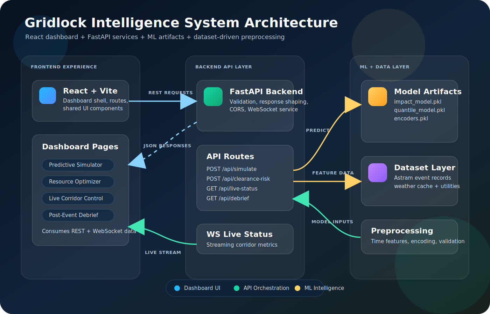
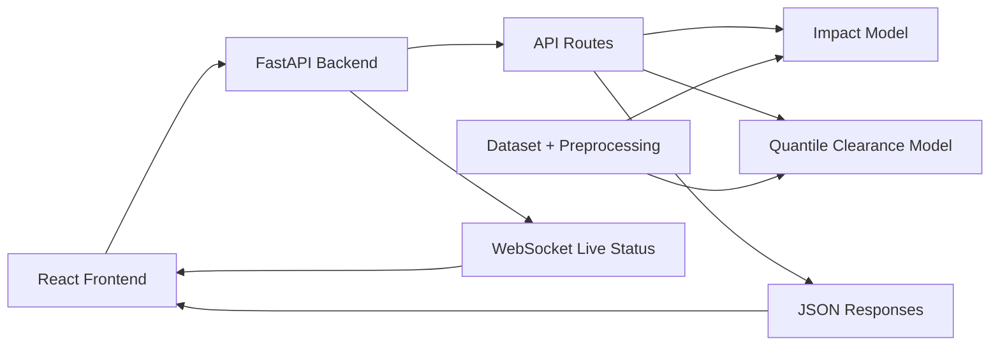
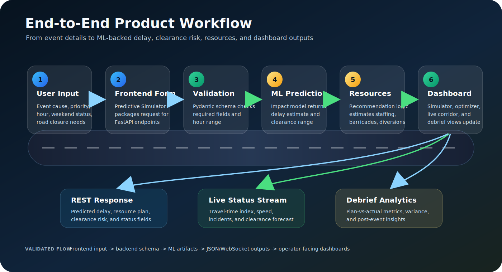
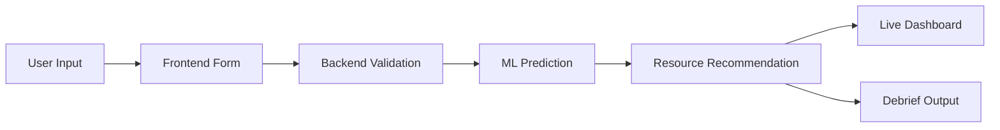

# gridlock_submission
For gridlock submission round 2

## System Architecture

The Gridlock Intelligence System connects a React dashboard to FastAPI services, ML model artifacts, and dataset-backed preprocessing utilities. The architecture supports both request/response prediction flows and live WebSocket corridor updates.

## Application Workflow

The product workflow starts with event details entered in the dashboard, validates the payload in the backend, runs ML-backed predictions, recommends operational resources, and returns results to simulator, optimizer, live control, and debrief views.

