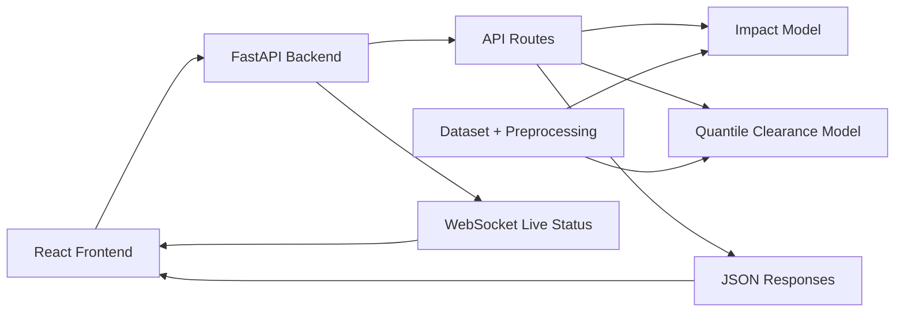
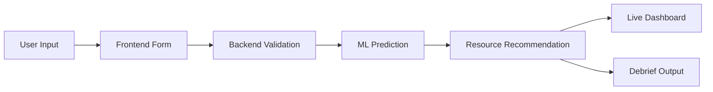

# Gridlock Intelligence System

> AI-assisted traffic impact intelligence for planning, live corridor response, and post-event debriefing.


Gridlock Intelligence System is a hackathon-ready traffic operations platform that connects a polished React dashboard with a FastAPI backend and ML-powered incident duration models. It helps simulate event-driven congestion, estimate clearance risk, recommend tactical resources, monitor live corridor status, and summarize post-event performance.

| Product Area | What It Does |
|---|---|
| 🧭 Planning | Simulates event impact before traffic deployment decisions are made. |
| 🚦 Operations | Streams live corridor metrics through a WebSocket-powered control view. |
| 🤖 Intelligence | Uses trained model artifacts for delay and clearance-time estimation. |
| 📊 Debrief | Compares planned vs actual traffic outcomes for future calibration. |

---

## Problem Statement

Major city events, incidents, weather disruptions, and road closures can quickly turn local congestion into corridor-wide gridlock. Traffic teams often need to answer difficult questions before and during an event:

| Challenge | Why It Matters |
|---|---|
| Congestion prediction | Teams need early visibility into likely delay and queue pressure. |
| Event-driven traffic impact | Public events, rallies, accidents, and closures affect traffic differently. |
| Live corridor monitoring | Conditions change after deployment, so operators need fast updates. |
| Resource recommendation | Staff, volunteers, barricades, and diversions must match risk level. |
| Post-event analysis | After-action review helps improve future simulations and response plans. |

This project addresses that workflow by turning event metadata into API-backed predictions, operational recommendations, and dashboard-ready outputs.

---

## Proposed Solution

Gridlock Intelligence System uses a full-stack, API-driven flow:

1. A React mobile-style dashboard collects or displays traffic event context.
2. FastAPI validates request payloads and coordinates prediction endpoints.
3. ML model artifacts estimate incident delay and clearance-time ranges.
4. A resource recommendation engine converts event risk into deployment needs.
5. WebSocket updates feed the Live Corridor Control dashboard.
6. Debrief analytics compare planned and observed operational outcomes.

| Layer | Role |
|---|---|
| Frontend dashboard | Provides simulator, optimizer, live control, and debrief views. |
| Backend APIs | Validates input, loads ML models, returns JSON-safe responses. |
| ML pipeline | Produces delay and clearance-risk predictions from event features. |
| Live status service | Streams changing corridor conditions to the operator UI. |
| Dataset utilities | Support training, harmonization, and weather-feature experimentation. |

---

## Key Features

| Feature | Description | Backing Implementation |
|---|---|---|
| 🧪 Predictive Simulator | Runs a scenario for a planned event and displays predicted delay. | `POST /api/simulate` |
| ⏱️ Clearance Risk Prediction | Returns optimistic, expected, and pessimistic clearance estimates. | `POST /api/clearance-risk` |
| 🧰 Resource Optimizer | Recommends sworn staff, volunteers, barricades, diversions, and budget. | `ResourceOptimizer.recommend()` |
| 📡 Live Corridor Control | Shows incident state, speed, active incidents, DMS status, and forecast. | `WS /api/ws/live-status` |
| 📈 Post-Event Debrief | Displays plan-vs-actual traffic volume, variance metrics, and importance bars. | `GET /api/debrief` |
| 🧠 ML Delay Estimation | Loads trained model artifacts at backend startup. | `impact_model.pkl`, `quantile_model.pkl` |
| 🛡️ Validation + Error Handling | Rejects invalid hours and required-field failures with schema validation. | Pydantic request model |
| 🔌 API-Driven Frontend | Frontend uses configurable API and WebSocket base URLs. | `frontend/src/config/api.js` |

---

## System Architecture

The Gridlock Intelligence System connects a React dashboard to FastAPI services, ML model artifacts, and dataset-backed preprocessing utilities. The architecture supports both request/response prediction flows and live WebSocket corridor updates.




## Application Workflow

The product workflow starts with event details entered in the dashboard, validates the payload in the backend, runs ML-backed predictions, recommends operational resources, and returns results to simulator, optimizer, live control, and debrief views.




---

## Tech Stack

| Category | Technologies |
|---|---|
| Frontend | React 19, Vite 7, React Router, Recharts, Leaflet, React Leaflet, lucide-react |
| Backend | FastAPI, Uvicorn, Pydantic, CORS middleware, WebSockets |
| ML/Data | pandas, NumPy, scikit-learn, LightGBM, pickled model artifacts, dataset preprocessing scripts |
| Testing | pytest, FastAPI TestClient, HTTPX, API contract tests, ML smoke tests |
| Tooling | npm lockfile, Python requirements, Vite build output, `.gitignore` cleanup rules |

---

## Backend API Overview

| Endpoint | Method | Purpose | Input / Output Summary | Frontend Usage |
|---|---|---|---|---|
| `/` | `GET` | Backend health/root message. | Returns welcome JSON. | Useful for API availability checks. |
| `/api/live-status` | `GET` | Snapshot of corridor status. | Returns travel-time index, speed, incident count, DMS status, dispatch time, estimated clearance, and forecast points. | Supports live metrics fallback-style data. |
| `/api/debrief` | `GET` | Post-event analytics payload. | Returns target delay, actual delay, variance, delay-hours, plan-vs-actual series, variance metrics, and importance data. | Used by Post-Event Debrief. |
| `/api/simulate` | `POST` | Predicts event traffic delay and resource needs. | Accepts event cause, priority, hour, weekend flag, road-closure flag, and optional attendance. Returns predicted delay and resources. | Used by Predictive Simulator and passed into Resource Optimizer. |
| `/api/clearance-risk` | `POST` | Predicts clearance-time range. | Uses the same event payload and returns P10, P50, and P90 clearance estimates. | Displayed in the simulator clearance forecast card. |
| `/api/ws/live-status` | `WS` | Streams live corridor updates. | Sends repeated JSON updates with metrics and clearance forecast. | Used by Live Corridor Control. |

### Request Payload Shape

| Field | Type | Notes |
|---|---|---|
| `event_cause` | string | Example categories include public event, accident, vehicle breakdown, political rally, or unknown categories. |
| `priority` | string | Used by model and resource recommendation logic. |
| `hour_of_day` | integer | Validated from `0` to `23`. |
| `is_weekend` | boolean | Passed into engineered features. |
| `requires_road_closure` | boolean | Affects model features and resource recommendations. |
| `attendance` | optional string | Parsed for resource scaling where available. |

---

## ML Pipeline Overview

The ML layer is implemented in `backend/ml_components/` and loaded directly by the FastAPI app at startup.

| Artifact / Module | Purpose |
|---|---|
| `impact_model.pkl` | Runtime artifact for point-estimate traffic delay prediction. |
| `quantile_model.pkl` | Runtime artifact for P10/P50/P90 clearance-time range prediction. |
| `encoders.pkl` | Preserved model-related artifact already tracked with the ML components. |
| `model_pipeline.py` | Preprocessing, feature engineering, LightGBM regression, resource recommendation logic. |
| `quantile_model.py` | Quantile regression models for clearance range estimation. |
| `evaluate.py`, `weather_experiment.py`, `survival_experiment.py` | Experiment/evaluation utilities, not required by the backend request path. |

### How Prediction Works

| Step | Detail |
|---|---|
| Preprocessing | Cleans event records, parses timestamps, derives duration, drops invalid durations, and engineers time features. |
| Feature Engineering | Uses categorical features such as event cause, priority, event type, corridor, and vehicle type plus numeric/cyclical time features. |
| Impact Model | Uses a LightGBM regressor wrapped in a scikit-learn pipeline with a log-transformed target. |
| Clearance Range Model | Trains separate LightGBM quantile models for optimistic P10, expected P50, and pessimistic P90 estimates. |
| Backend Consumption | FastAPI loads model artifacts and returns JSON-safe Python floats to frontend callers. |

Testing verified that the ML artifacts load, predictions are finite and positive, scenarios produce varied outputs, and quantile outputs remain ordered. The README intentionally does not claim production-level accuracy beyond the integration and smoke-test evidence present in the repository.

---

## Frontend Pages Overview

| Page | Route | What It Shows | Backend Interaction |
|---|---|---|---|
| Landing | `/` | Entry dashboard inside the phone-style frame. | Static dashboard entry view. |
| Predictive Simulator | `/simulator` | Event context, congestion projection, delay KPI, clearance range, inflow chart. | Calls `/api/simulate` and `/api/clearance-risk`. |
| Resource Optimizer | `/optimizer` | Relief factor, budget, staff, volunteers, barricades, roster, diversion plan. | Reads resource output saved from simulator response. |
| Live Corridor Control | `/live-control` | Active incident alert, map layer, dynamic metrics, clearance forecast. | Connects to `/api/ws/live-status`. |
| Post-Event Debrief | `/debrief` | Target vs actual delay, plan-vs-actual chart, variance metrics, SHAP-style importance, learning insights. | Fetches `/api/debrief`. |

The frontend also includes reusable UI components for cards, metrics, charts, maps, bottom navigation, and phone-frame layout.

---

## Testing And Validation Summary

The repository includes `TESTING_REPORT.md`, `DEEP_TESTING_REPORT.md`, and automated backend tests under `backend/tests/`.

| Validation Area | Result |
|---|---|
| Automated API/ML tests | `23` tests passed in the documented deep test run. |
| API contracts | Root, live status, debrief, simulate, clearance-risk, and WebSocket contracts were tested. |
| Payload validation | Invalid missing fields, nulls, negative hours, and hours above `23` return validation errors. |
| ML smoke checks | Model artifacts load, predictions are finite, scenario outputs vary, and quantile outputs are ordered. |
| Frontend build | Vite production build completed successfully in the documented test pass. |
| Browser happy path | Simulator, optimizer, live metrics/WebSocket, and debrief flows were verified. |
| Browser error path | Simulator, live feed, and debrief show visible fallback/error states when backend is unavailable. |
| Dependency hygiene | Python dependency check passed in the deep report. |

### Honest Residual Risks

| Risk | Notes |
|---|---|
| CORS policy | Backend currently allows all origins, which is acceptable for a demo but should be narrowed for production deployment. |
| npm audit | Could not be completed in the recorded environment because registry DNS access failed. |
| Bundle size | Vite reported a large JavaScript bundle warning; this is not a runtime failure but can be optimized later. |
| Model quality | Integration, output sanity, and variation were tested; deeper statistical validation remains future work. |
| Optional survival experiment | `scikit-survival` is intentionally not in the default backend install because the production API path does not import it. |

---

## Repository Structure

```text
gridlock_submission/
├── backend/
│   ├── api/
│   │   └── main.py
│   ├── ml_components/
│   │   ├── impact_model.pkl
│   │   ├── quantile_model.pkl
│   │   ├── encoders.pkl
│   │   ├── model_pipeline.py
│   │   └── quantile_model.py
│   ├── tests/
│   │   ├── test_api_contract.py
│   │   └── test_ml_smoke.py
│   ├── requirements.txt
│   └── test-requirements.txt
├── dataset/
│   ├── README.md
│   ├── download_datasets.py
│   ├── fetch_weather.py
│   ├── harmonize_data.py
│   └── Astram event data_anonymized - Astram event data_anonymizedb40ac87 (1).csv
├── docs/
│   └── assets/
│       ├── architecture-diagram.svg
│       └── workflow-diagram.svg
├── frontend/
│   ├── src/
│   │   ├── components/
│   │   ├── config/
│   │   ├── data/
│   │   ├── pages/
│   │   ├── App.jsx
│   │   └── main.jsx
│   ├── package.json
│   ├── package-lock.json
│   └── vite.config.js
├── TESTING_REPORT.md
├── DEEP_TESTING_REPORT.md
└── README.md
```

Generated dependency folders, local caches, virtual environments, logs, and platform metadata are intentionally excluded from this structure.

---

## Screenshots / Demo Placeholders

Actual screenshot assets are not currently stored in the repository, so this section uses clear placeholders instead of fake image links.

| Demo View | Placeholder |
|---|---|
| Predictive Simulator | Add a screenshot showing event inputs, congestion projection, delay KPI, and clearance range. |
| Resource Optimizer | Add a screenshot showing staffing, barricades, diversion count, roster, and diversion map. |
| Live Corridor Dashboard | Add a screenshot showing active incident alert, live metrics, WebSocket badge, and clearance forecast. |
| Post-Event Debrief | Add a screenshot showing plan-vs-actual chart, variance metrics, and learning insights. |

---

## Deployment-Readiness Notes

| Area | Status |
|---|---|
| Source code | Frontend, backend, ML components, and tests are organized into clear folders. |
| Generated junk | Local caches, `.venv/`, `.pytest_cache/`, logs, `node_modules/`, and generated build output are ignored. |
| Required model artifacts | `impact_model.pkl`, `quantile_model.pkl`, and `encoders.pkl` are treated as required ML artifacts. |
| Dependency manifests | `backend/requirements.txt`, `backend/test-requirements.txt`, `frontend/package.json`, and `frontend/package-lock.json` are preserved. |
| Tests | API contract tests and ML smoke tests are present. |
| Documentation assets | Architecture and workflow SVG diagrams are included under `docs/assets/`. |

---

## Future Scope

| Improvement | Why It Helps |
|---|---|
| Real-time traffic data integration | Replace simulated live metrics with city or sensor feeds. |
| Map-based route diversion | Turn diversion recommendations into interactive route alternatives. |
| Advanced model validation | Add richer holdout evaluation, calibration reports, and drift monitoring. |
| Cloud deployment | Package frontend/backend for a hosted demo environment. |
| Role-based dashboards | Separate planner, field operator, and command-center views. |
| Alerting system | Send notifications for high-risk congestion or missed clearance targets. |
| City-scale analytics | Aggregate event performance across corridors and time periods. |

---

## Contributors / Credits

Repository contributor history lists:

| Contributor |
|---|
| Sat R |
| abhay139 |
| satvikkesarwani |

Project documentation reflects only the functionality present in the repository: React frontend pages, FastAPI routes, ML artifacts, dataset utilities, and documented test reports.
